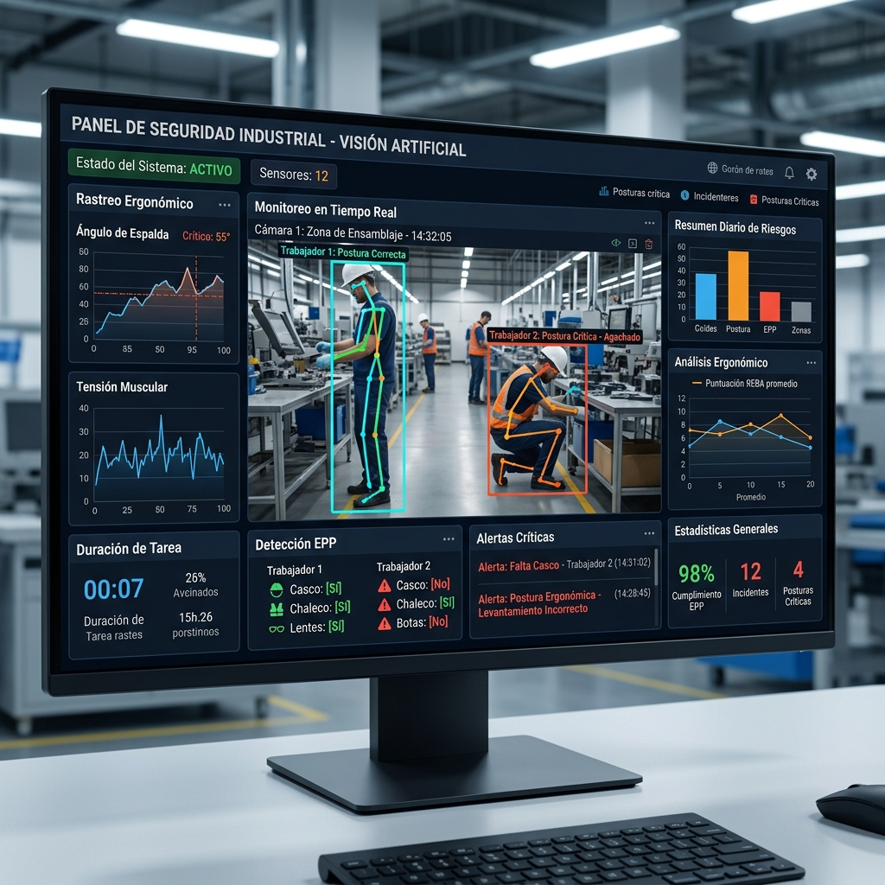

# 🛡️ SST 4.0 - Sistema de Visión Artificial para Seguridad Industrial



Este es un orquestador avanzado de visión artificial diseñado para la **Seguridad y Salud en el Trabajo (SST)**. El sistema utiliza inteligencia artificial para monitorear en tiempo real los riesgos ergonómicos y el uso de Elementos de Protección Personal (EPP).

## 🚀 Características Principales

- **Análisis Ergonómico Real-Time:** Cálculo automático de ángulos corporales usando métodos **RULA** y **REBA** para detectar malas posturas.
- **Detección de EPP:** Verificación de uso de casco, chaleco reflectante y otros elementos de seguridad.
- **Identificación Biométrica:** Reconocimiento de trabajadores mediante rostros para asignar las infracciones de forma precisa.
- **Generación Legal Automatizada:** Creación de borradores de documentos legales y actas administrativas en formato `.docx` al detectar infracciones críticas.
- **Notificaciones Inteligentes:** Integración con **n8n** para enviar alertas vía WhatsApp, Telegram o Email de forma inmediata.
- **Dashboard Interactivo:** Interfaz web moderna para visualizar estadísticas, niveles de riesgo y streaming de cámaras.

## 🛠️ Tecnologías Usadas

- **Backend:** Python, FastAPI, Uvicorn.
- **IA/Visión:** OpenCV, MediaPipe, DeepFace.
- **Frontend:** HTML5, CSS3 (Glassmorphism), JavaScript Vanilla.
- **Automatización:** n8n Webhooks.
- **Documentación:** Python-docx.

## 📦 Instalación y Uso Local

1. **Clonar el repositorio:**
   ```bash
   git clone https://github.com/sstpacheco-max/herramienta-de-posturas.git
   cd herramienta-de-posturas
   ```

2. **Instalar dependencias:**
   ```bash
   cd cv_backend
   pip install -r requirements.txt
   ```

3. **Ejecutar la aplicación:**
   ```bash
   python main.py
   ```

4. **Acceder al Dashboard:**
   Abre tu navegador en `http://localhost:8000`.

## 📁 Estructura del Proyecto

- `cv_backend/`: Núcleo de la aplicación Python.
  - `ergonomics_engine.py`: Lógica de RULA/REBA.
  - `epp_engine.py`: Detector de implementos de seguridad.
  - `biometry_engine.py`: Reconocimiento facial.
  - `legal_engine.py`: Generador de documentos `.docx`.
  - `static/`: Interfaz web del usuario.
- `n8n_workflow_sst.json`: Flujo de automatización para alertas.

---
Desarrollado para la modernización de la Seguridad Industrial 4.0.
